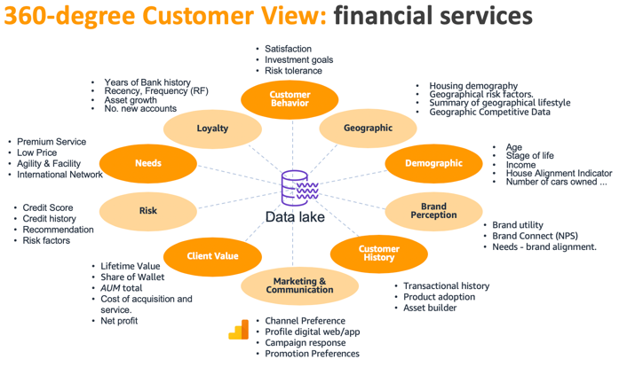
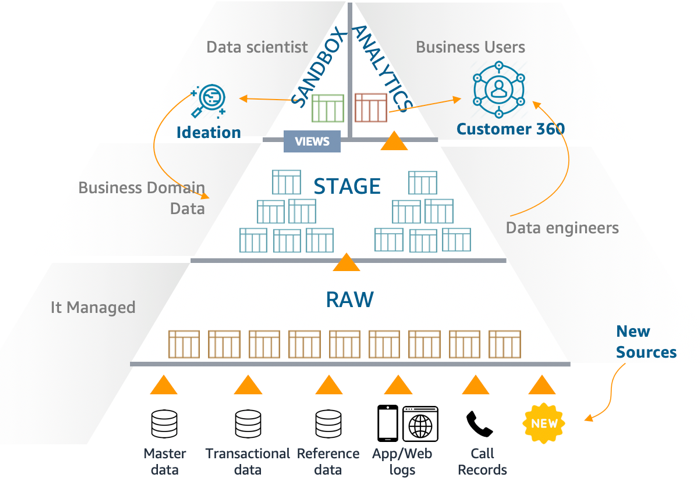
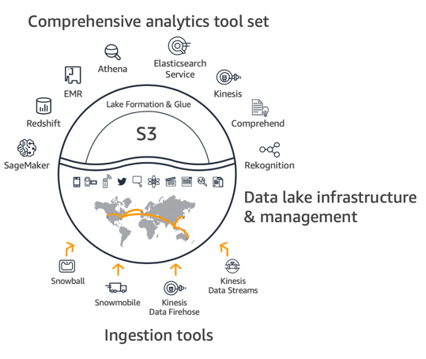
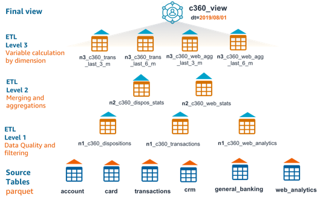
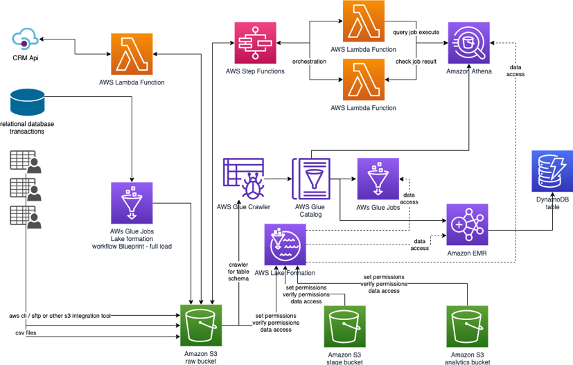

## Build a 360-degree customer view in AWS using a powerful set of analytics tools

One of the challenges of digital transformation across companies is the task of consolidating customer data in one place, what we call a 360-degree customer view. This is a powerful concept in CRM (Customer Relationship Management) used on a daily basis on marketing, sales and customer services areas. Gather and aggregate information to build such view help us to have a complete vision of who are our customers, what are their preferences, what they have looked for, and how their preferences are correlated to other people preferences and behavior.

This implementation can be used to refine customer personas, their behavior and expectations, get to know touchpoints of interaction, perform a better post-sale service, cross-selling or up-selling, build personalized recommendation, map customer journey, and identify the gaps in channels or processes.

The common pain point is that information about customer is spread across several systems inside your company, from customer interaction with your call center records to events related to customer search behavior, you have several different data that are difficult to correlate if you don’t have a Data Lake strategy.

This git demonstrated how to bring data from different data systems as a set of customer dimensions and build a 360-degree customer view as a baseline for all customer analytics initiatives.

## Dimensions for a 360-degree customer view

Usually we look at our customers from a perspective, such as Loyalty perspective, looking at metrics like: years of history, frequency of interaction, or a Demographic perspective: stage of life, income, stage of life. We call them dimensions, and we will combine several dimensions about your customer to give you more visibility of several perspectives at the same time.

In this git we will explore a hypothetic financial services company, as there are common dimensions for this industry and some dimensions that are also valid for any service industry, like marketing and communications, customer history or demographic dimension.

In the picture above we have list some of the dimensions, and the challenges we have to aggregate and use all this information is the number of different sources and formats.

For financial services we usually have a CRM (Customer Relationship Management) as a software as a service, that can be consumed by an API (Application Programming Interface) and provides JSON (JavaScript Object Notation) file format, Mainframe systems and some other systems that can be integrated by CSV (Comma-separated value) files, transactions from relational database generating thousands new records per minute and application logs or website navigation logs. New sources can come over time, like a new system or channel that are provided to customers.

## Data Lake strategy

Data lake is the source of truth, as a broad repository where we can put data from different systems and perform the cleaning, enrichment, aggregation, analysis to delivery relevant data to business users, about user behavior, assets, history, preferences and several other features.

To deliver summarized and at the same time comprehensive data about customer to business users and data scientists we need ingest data from the sources into a storage area and combine them to build a 360-degree customer view.

In a Data Lake we have some important tiers for the data and going from the bottom up, starting with data and ending up with strategic information for business decision:

-	The RAW layer is the first storage area for data coming from several different sources and formats, usually the data in this area are in plain text (CSV) or JSON and in some cases, they are compressed files such as Gzip.
-	STAGE is the storage area for the data we are handling, transforming and cleaning. In this layer we have control of the data format so we can storage the output in columnar formats such as Apache Parquet or Apache ORC compressed with Snappy that will have a better performance to join and aggregate data by columns or Apache Avro container files that has a JSON schema representation for each file.
-	Finally, we deliver information to the ANALYTICS layer for the business areas ready for consumption and with good performance. To achieve this, we partition the data and use columnar formats to make it easy and fast to query data, filter it or aggregate it.
-	In parallel, the SANBOX area is for the Data Scientists to interact with data from STAGE or even ANALYTICS data to build new data models, discover new correlations and build machine learning models.

So, the second challenge that comes is to have powerful analytics tools that can enrich, filter, clean and aggregate this data, analyze them and generate information. Also, the tools need to fit each of the needs for example Data Engineer transformation, from small to large volumes, a Data Scientist complex algorithm and a Business user query engine. There is no ‘silver bullet’ in the market, the best product for one step or role is not the best for another, and AWS provides a broad variety of these tools.

## Data Lake in AWS

Data lake in AWS has a key storage component Amazon S3 that stores, secure and maintain data in a very cost-effective way and provides high throughput with the AWS ingestion and the analytics tools.

To ingest data into our data lake we can use AWS Snowball to send large amount of files, AWS Direct Connect connection for high speed network data transfer, and services like AWS DataSync, AWS Data Migration Service and AWS Transfer for SFTP for different needs to ingest data in our AWS data lake. Also Amazon Kinesis Data Streams and Amazon Kinesis Data Firehose to ingest streaming data.
In this git we are using AWS Lake Formation blueprints and  AWS Lambda functions to extract data actively from some sources and APIs, and also Amazon S3 direct put files from legacy systems.

To transform data we can use serverless fully managed AWS Glue jobs, a powerful and flexible Hadoop and Spark ecosystem Amazon EMR, and small jobs and streaming processing with AWS Lambda functions orchestrated by AWS Step Functions, and executed with lake Amazon Athena query engine, that also supports create new tables and insert data, we will explore uses cases for each of them in this git.

Amazon DynamoDB can be used to deliver data in a very low latency and scalable way, we are going to delivery consumable information about our customer for business users.

## Our 360-degree customer view approach

We suggest a final denormalized customer 360 table on top of the Data Lake that can be update on an hourly, daily or weekly basis depending the delta frequency of new data on the source tables and the business need. This final view will be generated from intermediate tables across several layers depending its degree of processing in all transformation steps using a bottom up approach. This tables can be named using a hierarchical naming convention to facilitate the data lineage, give a sense of hierarchy, allow the addition of new tables on the overall ETL orchestration process.

The picture represents from bottom to the top the data quality and filtering, aggregation and dimension calculations.

## Architecture overview

From the right left-hand side, we start with the sources, were we simulate a CRM API with two AWS Lambda functions one that act like an API generating the data an another to consume this API calling it and receiving and processing the result. We also have a relational database using Amazon RDS, we are using PostgreSQL as the engine, and finally we have flat files that commonly are generated by mainframe, in our cases we simulated the generation using AWS Lambda.

We use AWS Lake Formation blue prints to orchestrate the extraction from the relational database to Amazon S3, using AWS Glue connector and Glue jobs.
Then on the bottom we have the persistent layer on Amazon S3 the base for our Data lake strategy, with Raw, Stage and Analytics buckets.
For processing we are counting with Step Functions orchestrating AWS Lambda using Athena on the top, we also have AWS Glue Jobs, using Spark and Python, and Amazon EMR using Spark and Hive to transform and aggregate data.

To consume the data, we have Amazon Athena query engine console and API, and Amazon DynamoDB console and API.

## To deploy the example in your account go to [Deployment](deployment/README.md)

## License

This library is licensed under the MIT-0 License. See the LICENSE file.
