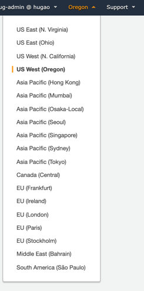
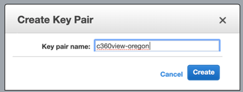
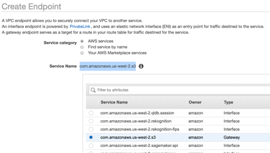
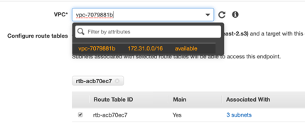
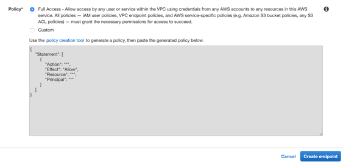

## Solution deployment with AWS CloudFormation - AWS Account required

## Required setup

Perform the following steps before you launch the CloudFormation template.
### Create key pair in Oregon

**Step 1:** Login in AWS console with your account login properties.

**Step 2:** Select Oregon region (us-west-2). At the top right side of your console check if you are doing in the right Region.

**Step 3:** Create a Key pair in Oregon:

**Key pair name:** c360view-oregon

Click on Create key pair button.

**Step 4:** Download key pair.

If you are in a **Windows** machine please download the key as **ppk** file.
If you are in a **Mac** or **Linux** please download the key as **pem** file.

### Create VPC endpoint for Amazon S3

**Step 1:** Go to Amazon VPC console to create an endpoint for Amazon S3.

**Step 2:** Choose AWS Services.

**Service Name:** *com.amazonaws.us-west-2.s3*
It will probably be in second pagination of AWS services.

**Step 3:** Select the Default VPC.

**Step 4:** Check the Route Table ID as above.

**Step 5:** Keep the Full access policy and don’t change the policy.

**Step 6:** Create endpoint.

## Deploy [CloudFormation](cloudformation/README.md)

## License

This library is licensed under the MIT-0 License. See the LICENSE file.
