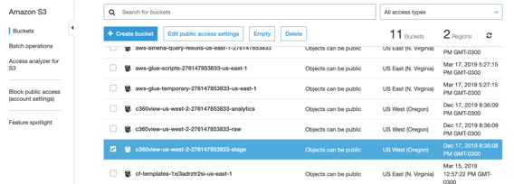
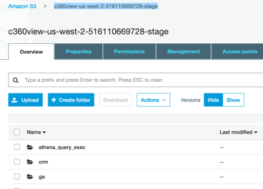
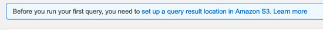
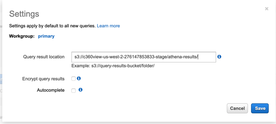
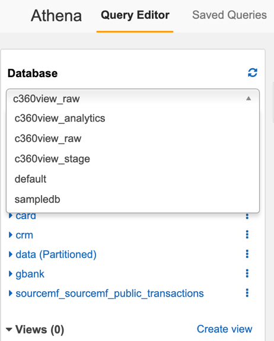
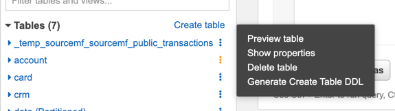
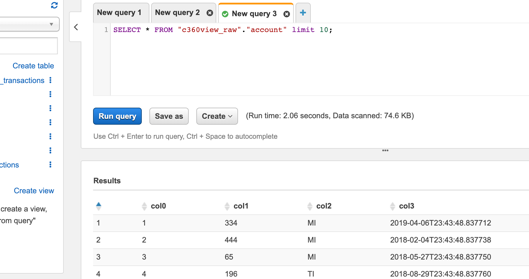
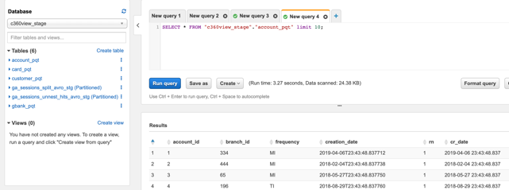

## Access Amazon Athena console to check the raw and stage tables created so far.

**Step 1:** Go to [Amazon S3](https://s3.console.aws.amazon.com/s3/home?region=us-west-2) console and copy your c360view-us-west-2-<account id>-stage bucket name.

**Step 2:** Click on the stage bucket to open it.

**Step 3:** At the top right of the screen mark and Copy the bucket name

**Step 4:** Go to [Amazon Athena](https://us-west-2.console.aws.amazon.com/athena/home?region=us-west-2) console and setup your bucket output to your stage bucket on settings.

**Step 5:** Click on the ‘set up a query result location in Amazon S3’ message.

Type s3://< your_stage_bucket_name >/athena-results/ as location path.

**Step 6:** Choose c360view_raw to check the raw tables.

**Step 7:** Click on the 3 dots at the right of table account, and select Preview table.

**Step 8:** Check the results.

Notice that as we had CSV without header the name of the columns where crawled as col0 to col3 in the RAW data.
You can edit this on AWS Glue, but our jobs to processed the data in Step Functions are already aware of it.

If you go to c360view_stage database you will find a different scenario.

**Step 9:** Check the other tables data and then go to the c360view_stage database.

## [Access Amazon Athena console to check the raw and stage tables created so far.](../athena/README.md)

## License

This library is licensed under the MIT-0 License. See the LICENSE file.
