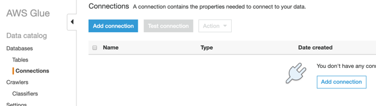
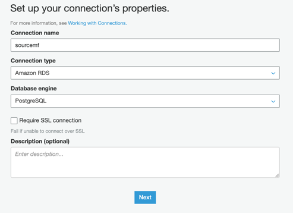
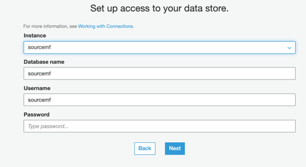
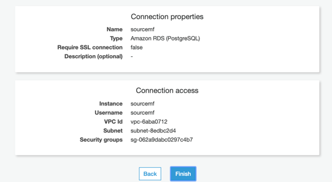

## Create a connection for relational database as source.

**Step 1:** Go to [AWS Glue Database Connections](https://us-west-2.console.aws.amazon.com/glue/home?region=us-west-2#catalog:tab=connections), and Add connection.

*	**Connection name:** sourcemf
*	**Connection type:** Amazon RDS
*	**Database Engine:** PostgreSQL

**Step 2:** Set up access, choosing your Instance sourcemf:

*	**Instance:** sourcemf
*	**Database name:** sourcemf
*	**Username:** sourcemf
*	**Password:** Tim3t0change

**Step 3:** Click on **Finish:**

**Step 1:** Go to [Amazon S3](https://s3.console.aws.amazon.com/s3/home?region=us-west-2) console to check the data in your raw bucket.
Go to Amazon S3 console to check the data in your raw bucket.

Search for c360view buckets.

**Step 2:** Click on the c360view-us-west-2-<YOUR_ACCOUNT_ID>-raw bucket.
Refresh the bucket while the lambda codes are running.

**Step 3:** Enter inside each folder to check the files created inside.

Account data, at account folder.

GA sessions data, at data/GA/ga_session_20YYMMDD folders.

**Step 4:**

**Step 5:**

## Setup [Lake Formation](../lakeformation/README.md)

## License

This library is licensed under the MIT-0 License. See the LICENSE file.
