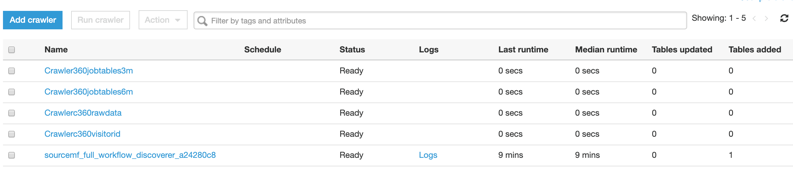
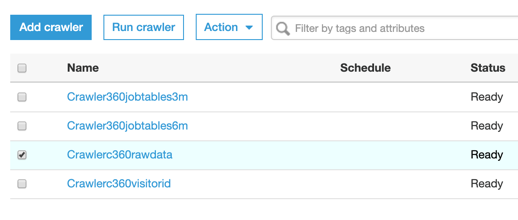
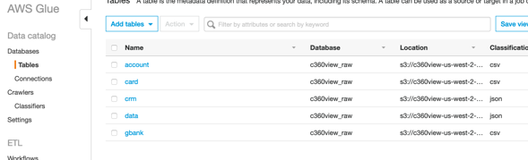
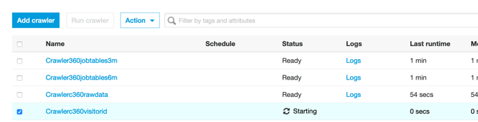
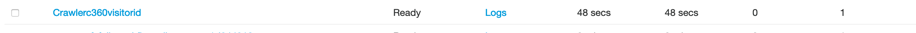

## Execute a crawler at AWS Glue Console to get tables definitions from your raw bucket.

**Step 1:** Go to AWS [Glue Crawlers](https://us-west-2.console.aws.amazon.com/glue/home?region=us-west-2#catalog:tab=crawlers):

**Step 2:** Click on the Crawler360rawdata and Run crawler.

*	•	This crawler will read your raw bucket files and create table definitions for each of the table schema for database c360view-raw.

**Step 3:** You should see 5 tables added by Crawler.

**Step 4:** You can verify them going to Database -> Tables in the same console.

**Step 5:** Select Crawlerc360visitorid and run crawler.

You should see **one table** added by the crawler.

## [Create a workflow to bring data from your transactional relational database.](../workflow/README.md)

## License

This library is licensed under the MIT-0 License. See the LICENSE file.
