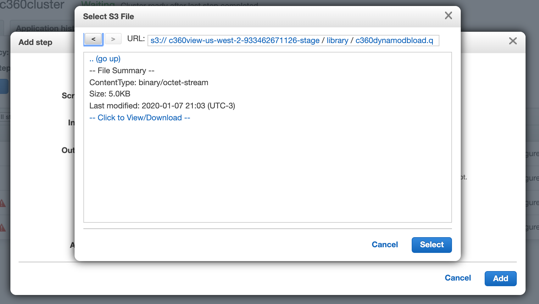
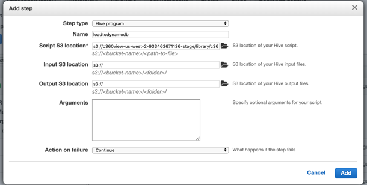
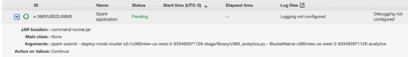
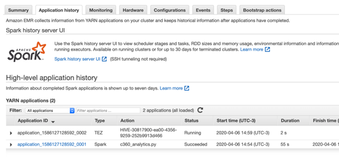

## Populate an Amazon DynamoDB table with the results to be the source for low latency queries from your applications or APIs.

We are going to use a Hive script to perform the query on source table and save it DynamoDB.

**Step 1:** Go to [EMR console](https://us-west-2.console.aws.amazon.com/elasticmapreduce/home?region=us-west-2).

**Step 2:** click on c360cluster.

**Step 3:** click on Steps tab.

**Step 4:** Add step.
*	**Step type:** Hive program
*	**Name:** loadtodynamodb
*	**Script S3 location:** s3://<your_stage_bucket>/ library/c360dynamodbload.q
Use the bucket browser to select the application location.

*	**Input S3 location:** leave blank
*	**Output s3 location:** leave blank
*	**Arguments:** leave blank
*	**Action on failure:** continue

**Step 5:** check the job status, going from pending to running.

**Step 6:** Check all applications status on the Application history tab.

## [Now you can query data from Amazon DynamoDB.](../viewddb/README.md)

## License

This library is licensed under the MIT-0 License. See the LICENSE file.
