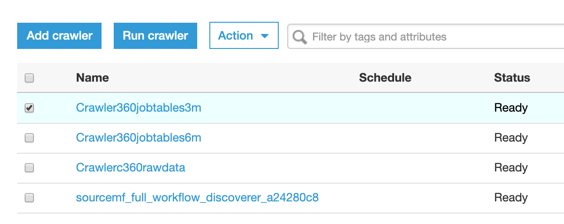
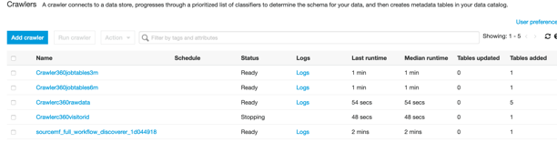
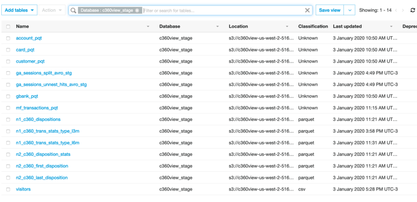

## Run the Glue crawler Crawler360jobtables3m, Crawler360jobtables6m to pick up definition for the data just created by the last job.

**Step 1:** Go to [AWS Glue crawler console](https://us-west-2.console.aws.amazon.com/glue/home?region=us-west-2#catalog:tab=crawlers).

**Step 2:** Select Crawler360jobtables3m and run crawler.

**Step 3:** Select Crawler360jobtables6m and run crawler.

**Step 4:** Verify that each new crawler run has added one table definition.

**Step 5:** Check the tables, you can filter by Database at search bar for c360view_stage.
We have now 14 tables in the c360view_stage database.

## [To create a denormalized table we are going to run a job on Amazon EMR.](../emr/README.md)

## License

This library is licensed under the MIT-0 License. See the LICENSE file.
