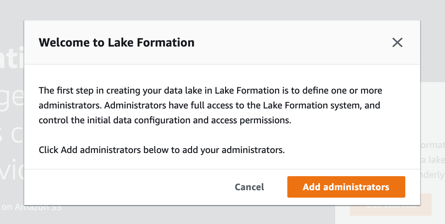
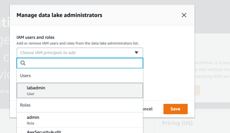
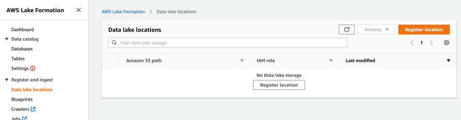
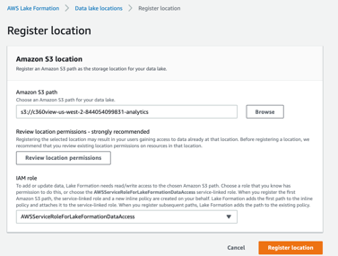
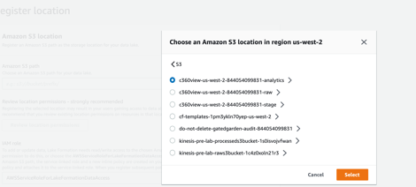
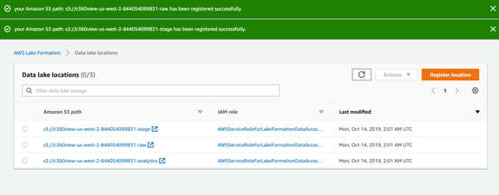
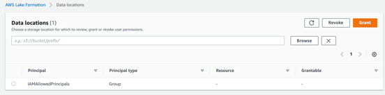
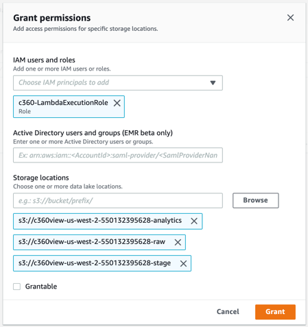
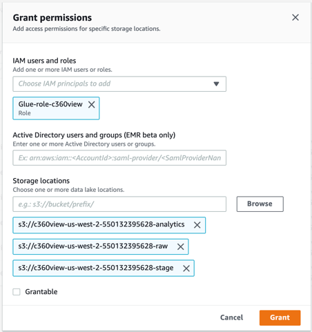
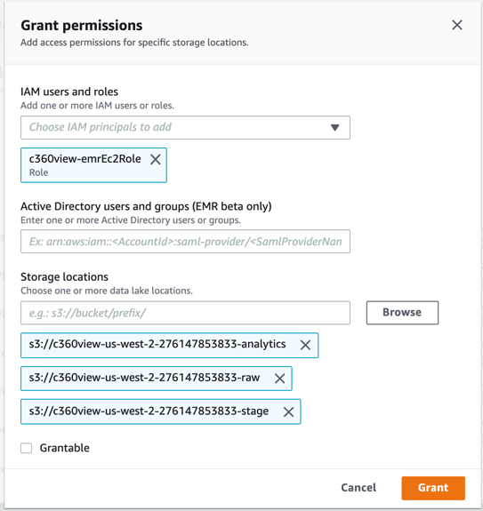

## Setup your Data Lake with Lake Formation

**Step 1:** Go to the [Lake Formation console](Go to the Lake Formation console:):

If this first screen doesn’t open like this go to Permissions -> Admins and database creators, and grant your user as administrator.

**Step 2:** Add your user as Data Lake admin, so your user can administer storage areas, databases and tables.

Add your user as Administrator and Save

**Step 3:** Add the buckets starting with “c360view” as [data lake locations](https://us-west-2.console.aws.amazon.com/lakeformation/home?region=us-west-2#register-list) for Lake Formation. Indicating there are part of your data lake.

**Step 4:** Click Register location.

**Step 5:** Click on Browse and select each c360view bucket to register.

Repeat it for the 3 buckets:
*	c360view-us-west-2-<your_account_id>-raw
*	c360view-us-west-2-<your_account_id>-stage
*	c360view-us-west-2-<your_account_id>-analytics
After registration you will see a screen like the following.

**Step 6:** On Lake formation data locations permission console Click on Grant to grant access to the AWS Lambda, AWS Glue service role and Amazon EMR EC2 role.

*	IAM users and roles: **c360-LambdaExecutionRole**
#### Storage locations:
  *	c360view-us-west-2-<your_account_id>-raw
  *	c360view-us-west-2-<your_account_id>-stage
  *	c360view-us-west-2-<your_account_id>-analytics

**Step 7:** Grant same locations to **Glue-role-c360view**.
*	IAM users and roles: **Glue-role-c360view**
#### Storage locations:
  *	c360view-us-west-2-<your_account_id>-raw
  *	c360view-us-west-2-<your_account_id>-stage
  *	c360view-us-west-2-<your_account_id>-analytics

**Step 8:** Grant same locations to **c360view-emrEc2Role**
•	IAM users and roles: **c360view-emrEc2Role**.
#### Storage locations:
o	c360view-us-west-2-<your_account_id>-raw
o	c360view-us-west-2-<your_account_id>-stage
o	c360view-us-west-2-<your_account_id>-analytics

## Now [Activate schedules](../schedules/README.md)

## License

This library is licensed under the MIT-0 License. See the LICENSE file.
