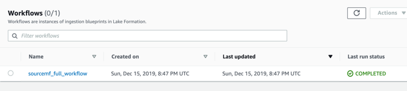
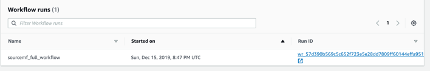
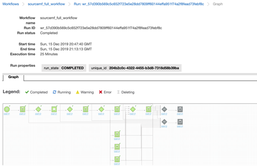
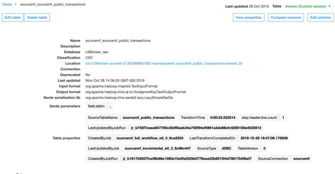
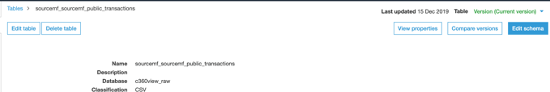
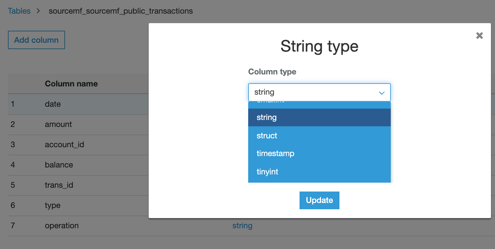

## Let’s go back to the Lake formation workflow that extracts data from our relational database, to see it has finished.

Go to Lake Formation Workflows Blueprints, wait to see your workflow COMPLETED.

**Step 1:** Click on the sourcemf_full_workflow and then on the Run ID.

**Step 2:** Verify the completion of this workflow, that reads data from the relational database and then save it to Amazon S3.

For your ongoing database changes, you can create an Incremental Workflow and use an incremental column in your table as your bookmark key.

**Step 3:** Go to AWS Glue and see the table definition that was created with the full load and incremental data.

**Step 4:** Click Edit schema on the top right position for table sourcemf_sourcemf_public_transactions.

**Step 5:** Click on the date Data type field for column date to change it from timestamp to string.

**Step 6:** Select string for date column type. Because the timestamp format is not ok and has to be fixed with a job.

**Step 7:** Update and Save

**Step 8:** Confirm that you have saved the new schema, by checking if date column is updated to string column type, go to [table definition](https://us-west-2.console.aws.amazon.com/glue/home?region=us-west-2#table:name=sourcemf_sourcemf_public_transactions;namespace=c360view_raw).

## [PPerform transformation with relational database source raw tables and to have it transformed to parquet files.](../transdb/README.md)

## License

This library is licensed under the MIT-0 License. See the LICENSE file.
