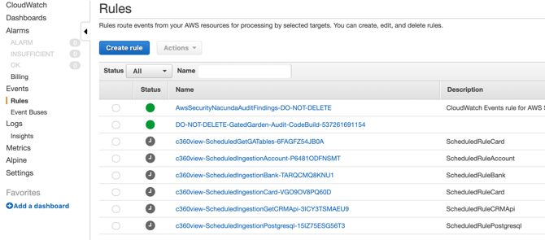

## Deploy CloudFormation template to create basic infrastructure

**Step 1:** Go to [CloudWatch Events -> Rules](https://us-west-2.console.aws.amazon.com/cloudwatch/home?region=us-west-2#cw:dashboard=Home), and enable each of the c360v-Schedule.

**Step 2:** Open the AWS [Cloudformation stack creation](https://us-west-2.console.aws.amazon.com/cloudformation/home?region=us-west-2#/stacks/create/template) And Upload a template file.

**Step 3:** Choose Next and fill up the parameters:

* **Stack name:** c360view
*	**Network Configuration:**
 *	Which VPC should this be deployed to?: *Default VPC (172.31.0.0/16)*
 *	SubnetAz1: (172.31.0.0/20) (look for this IP range)
 *	SubnetAz2: (172.31.16.0/20) (look for this IP range)
*	**InstanceKeyPairParameter:** c360view-oregon (the one that you created before)

**Step 4:** Choose Next for the next window.

**Step 5:** Check the “I acknowledge that AWS CloudFormation might create IAM resources.”  and Create stack.

**Step 6:** Go to Resources tab to look for completion of resources.

The template has created the following resources to optimize your time.
3 Amazon S3 buckets:
*	RawDataS3Bucket
*	StageDataS3Bucket
*	AnalyticsDataS3Bucket

1 RDS instance with PostgreSQL database to simulate your transaction database.
*	RDSSource – sourcemf

6 Lambda functions to generate data for different source.
*	c360viewCRMApi
*	c360viewGetCRMApi
*	c360viewGetGaTables
*	c360viewMFgenAccount
*	c360viewMFgenCard
*	c360viewMFgenGBank
5 CloudWatch events schedules, to trigger the Lambda functions.

2 Security group, firewalls, one for the EC2 instance, other for Replication instances and Lambda functions.

1 Role for the AWS Lambda functions
1 Role for the AWS Glue

1 Amazon EMR cluster

Check the status of each resource, and order by resource status.

If the resource Type “AWS::RDS::DBInstance” and “AWS::EMR::Cluster” are the only with status CREATE_IN_PROGRESS, and all the others are CREATE_COMPLETE you can continue the execution.

## Now [Activate schedules](../schedules/README.md)

## License

This library is licensed under the MIT-0 License. See the LICENSE file.
