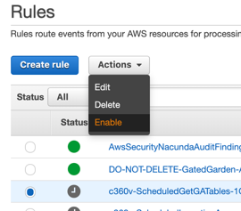
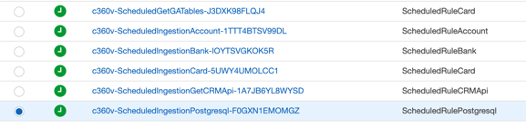
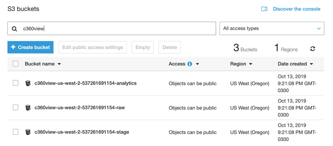
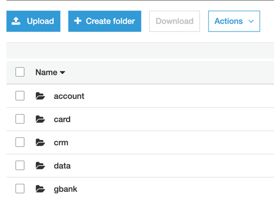
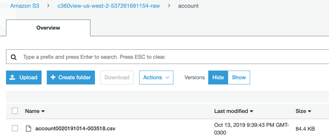
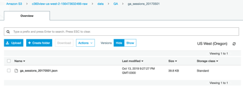

## Activate the schedulers to generate data from different sources


**Step 1:** Go to [CloudWatch Events -> Rules](https://us-west-2.console.aws.amazon.com/cloudwatch/home?region=us-west-2#cw:dashboard=Home), and enable each of the c360v-Schedule.


**Step 2:** Check the item, go to Actions and Enable.




**Step 3:** Repeat step 2, this until all are green.




## Verify the data created by the Lambda functions.

Amazon S3 is the central service of Data Lake architecture in AWS. In our solution we are using Lambda functions to pick external data such as BigQuery from GA (Google Analytics)  source: https://www.kaggle.com/bigquery/google-analytics-sample tables and also generate several other synthetic data for other data sets.
The original AWS Lambda code used to extract BigQuery data is the following.

```python
python
from google.cloud import bigquery
import json
import boto3
import os
s3 = boto3.resource('s3')
client = bigquery.Client.from_service_account_json(
    './bqfile.json')
datasets = list(client.list_datasets())
project = client.project
table = os.environ['table']
PATH_TO = os.environ['path_to']
BUCKET_NAME = os.environ['bucket']
QUERY = (
    'SELECT '
    ' TO_JSON_STRING(g) jsonfield '
    ' FROM ` bigquery-public-data:google_analytics_sample..ga_sessions_'+table+'` g '
)
query_job = client.query(QUERY)  # API request

def lambda_handler(event, context):
    tofile=''
    rows = query_job.result()
    for row in rows:
        newfield=row.jsonfield+'\n'
        tofile += newfield
    s3.Object(BUCKET_NAME, PATH_TO+'/ga_sessions_' + table+'/ga_sessions_'+table+'.json').put(Body=tofile)
```

If you want to this code you have to install the the gcloud python sdk libraries directory and generate a bqfile.json with your gcloud service account credentials, then zip the library directory, bqfile.json, and your lambda.py to deploy it to AWS Lambda functions.
Set three environments variables to use it or call table, path_to and bucket.


**Step 1:** Go to [Amazon S3](https://s3.console.aws.amazon.com/s3/home?region=us-west-2) console to check the data in your raw bucket.
Go to Amazon S3 console to check the data in your raw bucket.

Search for c360view buckets.




**Step 2:** Click on the c360view-us-west-2-<YOUR_ACCOUNT_ID>-raw bucket.
Refresh the bucket while the lambda codes are running.




**Step 3:** Enter inside each folder to check the files created inside.



Account data, at account folder.



GA sessions data, at data/GA/ga_session_20YYMMDD folders.


**Step 4:**

**Step 5:**


## Now [Activate schedules](../schedules/README.md)


## License

This library is licensed under the MIT-0 License. See the LICENSE file.
