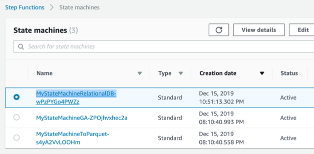
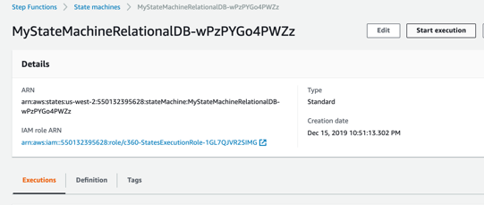
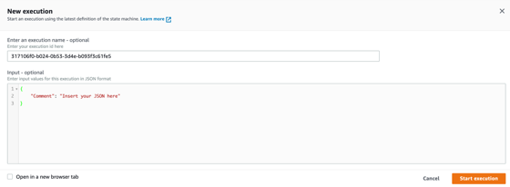
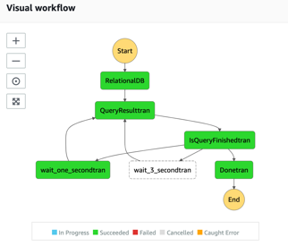
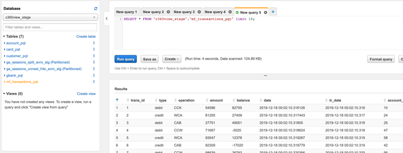

## Perform transformation with relational database source raw tables and to have it transformed to parquet files.

Check in your step functions [State machine console](https://us-west-2.console.aws.amazon.com/states/home?region=us-west-2#/statemachines).

**Step 1:** Click on the Relational database transformation “MyStateMachineRelationalDB-<hash>”.

**Step 2:** Start execution.

**Step 3:** Do not change the parameters and confirm Start execution.

**Step 4:** Verify the completion of the workflow. (Refresh your browser)

**Step 5:** Go to [Amazon Athena console](https://us-west-2.console.aws.amazon.com/athena/home?region=us-west-2#query), c360view_stage database and check the table mf_transactions_pqt.

## [Now you are going to perform more advanced transformations using AWS Glue job, first using python shell, then with Pyspark.](../pyspark/README.md)

## License

This library is licensed under the MIT-0 License. See the LICENSE file.
