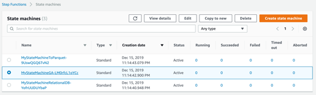
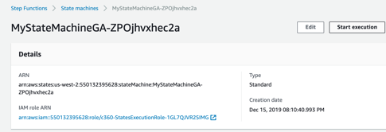
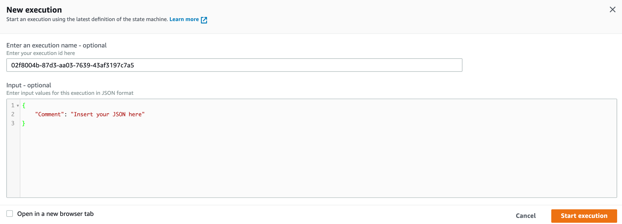
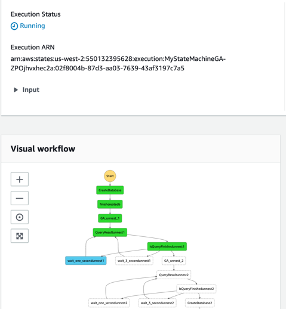
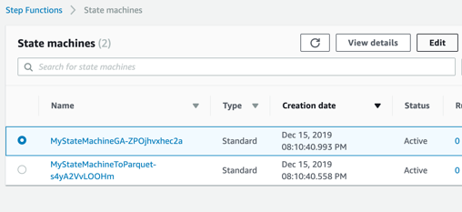
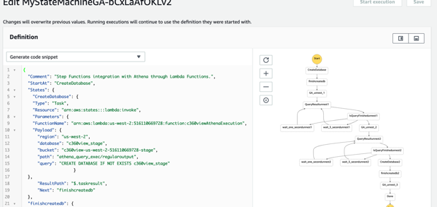
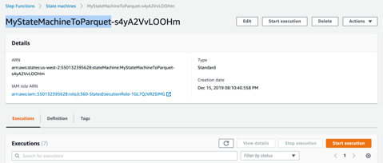
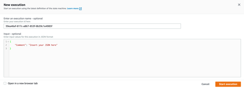
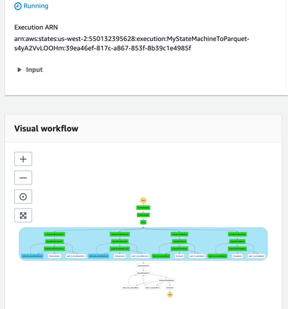

## Perform transformation with source raw tables and to have it flatten and transformed to parquet files.

Your CloudFormation template has created 3 different transformation jobs based on AWS Step Functions, AWS Lambda Functions and Amazon Athena.
One to transform GA tables in a flat denormalized table, a second one to transform other RAW data tables into parquet, partitioned tables, and a last one to process and a third one to parse data from relational database raw data.

Check in your AWS Step Functions [State machine console](https://us-west-2.console.aws.amazon.com/states/home?region=us-west-2#/statemachines).

**Step 1:** Click first the GA transformation “MyStateMachineGA-<hash>”.

**Step 2:** You will start execution for this State machine.

**Step 3:** Start execution for this State machine.

**Step 4:** You don’t need to change anything, accept the suggested payload, and start execution.

**Step 5:** Check the workflow.

In this step functions state machine, we are performing transformation for GA tables. GA schema has nested fields that are being flatten using CROSS JOIN UNNEST functions and qualifying nested struct and array data types.

*	This state machine uses one lambda function to execute the transformation using Amazon Athena query execution.
*	Another lambda function is used to check the termination of the previous query, and then wait or go to next transformation steps.

## You can check each of the code transforming data in your step functions State machine console.

**Step 1:** Edit your GA state machine.

**Step 2:** Go to definition tab.

You can check in the “query” field of “Payload” in each task, what are the queries executed in each step.

## Perform the transformation from CSV format to parquet format for the tables gbank (general banking), account and card, and from Json format to parquet format for the customer (CRM) table.

**Step 1:** Click the parallel transformation “MyStateMachineToParquet-<hash>”, and start execution.

**Step 2:** Do not change the parameters, and Start execution.

**Step 3:** Verify the workflow to see that in this case we are performing 4 transformation in parallel, you can also edit it to check the queries performed using a Lambda function to execute query in Amazon Athena.

Refresh your browser to check for completion.

**Step 4:**

## [Perform transformation with source raw tables and to have it flatten and transformed to parquet files.](../transformation/README.md)

## License

This library is licensed under the MIT-0 License. See the LICENSE file.
