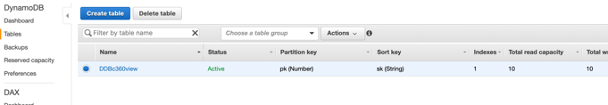
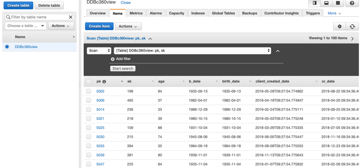
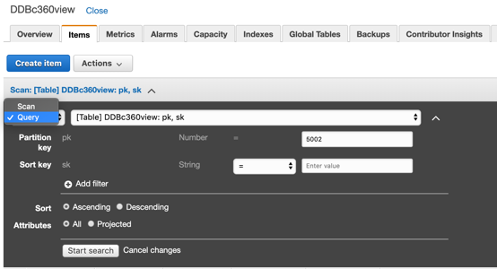
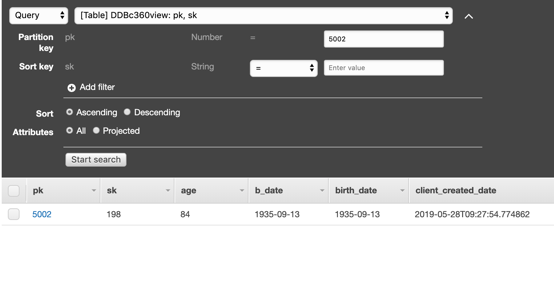
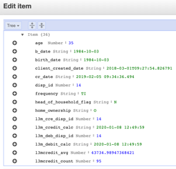
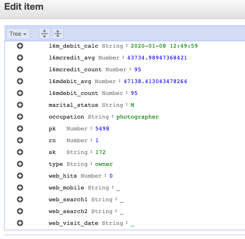
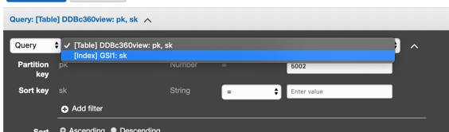
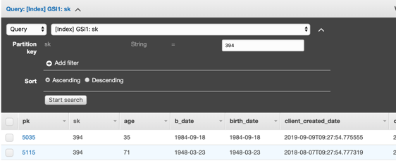
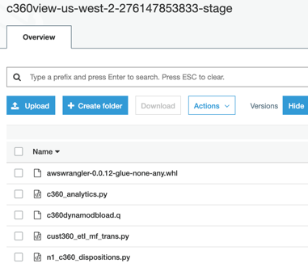
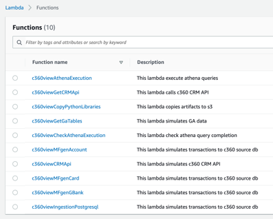

## Populate an Amazon DynamoDB table with the results to be the source for low latency queries from your applications or APIs.

**Step 1:** Go to [Amazon DynamoDB console](https://us-west-2.console.aws.amazon.com/dynamodb/home?region=us-west-2#tables:selected=DDBc360view;tab=items).

**Step 2:** Click on the table DDBc360view that you have populated with a Hive script using yor EMR cluster.

Notice that the console did a Scan operation, returning all data, but in your application, you may want to be specific and use a client id or/and branch for example.

**Step 3:** So, take note of some pk (partition key), that is your “client_id” from denormalized table and sk (sort key) that is your “branch_id”, so you can perform some specific query.
In my case, I can use 5002, 5006, 5014, 5021, 5025, 5035… and so on for client id (our pk), and 198, 465, 236, 218, 109, 215, 394, 381, 225 for branch.
Your numbers will be different as the data being generated in your account is random.

**Step 4:** Scroll the view to the right and down so you can check other fields for the records.

**Step 5:** Now instead of Scan, select Query and put a value of client id in the pk field. In my case 5002, but select one of yours taken in previous step.

**Step 6:** click on Start search and see that it’s display right away.

**Step 7:** click at the pk link for the id you chose so you can see the full payload.

### Repeat this for some customer ids.

## You did a query by partition key, you can also use the index to directly find for every customer in a branch by choosing the index already created GSI1 index that is a Global secondary index.

Using GSIs we can change the query key by other field we need to find data very fast.

**Step 1:** GSelect the GSI1 index to query.

**Step 2:** Put a branch number, such as 394 in my case.

You can enter in the pk of the desired client and see the whole profile.

The use case for this Amazon DynamoDB table is to have fast access to data when you need to interact directly with your customer for example your mobile branch manager application, or your contact center application to check the profile or even other dimensions you decide to increment here, like next best offer.

There are several examples to expose a DynamoDB table with an API, using Amazon API Gateway, like this blog, but if your application resides inside your AWS account you probably may use calls directly to DynamoDB SDK and API.

If you want to check other codes used go to your stage bucket, library folder.

You can also check the lambda functions code on AWS Lambda console by click in any of them.

For Data scientists and business users, you can also use Amazon Sagemaker and Amazon Quicksight to explore the data using Athena. Find more details on the links for creating data set from Athena on Quicksight and run SQL queries in Sagemaker.

Important, after playing with the environment disable or delete all the CloudWatch schedules created to avoid creating new data, empty your c360view S3 buckets and go to CloudFormation console to delete the whole c360view stack, that will delete your transactional database RDS, EMR cluster and all the other resources.

##Summary

In this blog you have learned a point of view of a 360-degree customer strategy. You have seen the data lake strategy using Amazon S3 and Lake Formation. We have explored some dimension for financial services, but as you follow the processes to bring data sources and the processing tools, it’s easy to add new sources and new calculations.
You have used several AWS services such AWS Lambda functions used to process data using Athena API and Step functions, then AWS Glue for spark and python jobs, and finally the capabilities of Amazon EMR using Spark and Hive to generate the final tables in Data Lake and also on DynamoDB.

## License

This library is licensed under the MIT-0 License. See the LICENSE file.
