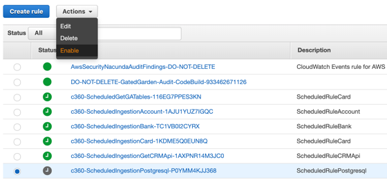
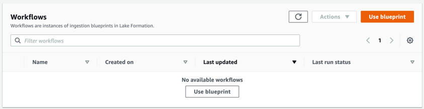
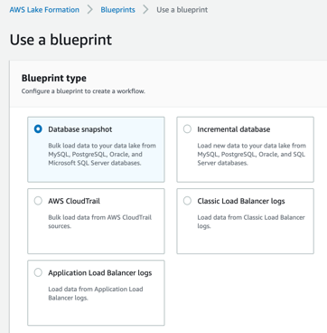
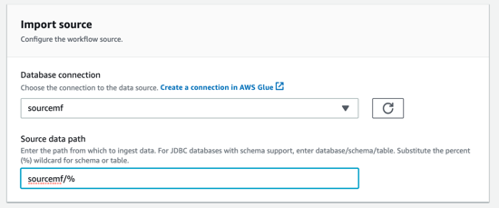
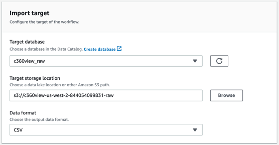
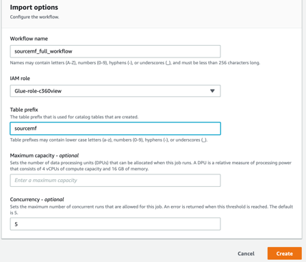
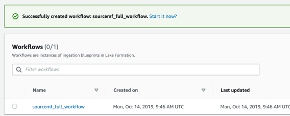
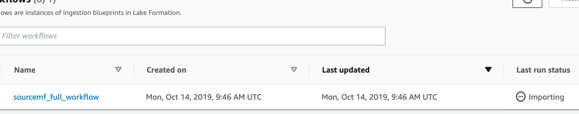

## Create a workflow to bring data from your transactional relational database.

Check in your [CloudWatch events Rules](https://us-west-2.console.aws.amazon.com/cloudwatch/home?region=us-west-2#rules:) if you have started the c360-ScheduledIngestionPostgresql-<your account id>, as it has been created later maybe you did not start this one yet.

**Step 1:** If this Rule is not “green”, please enable it now on Actions.

**Step 2:** Lake Formation Use blueprint to import data from a relational database
Go to [Lake Formation Workflows Blueprints](https://us-west-2.console.aws.amazon.com/lakeformation/home?region=us-west-2#workflows), and Use a Blueprint.

**Step 3:** Choose database snapshot

*	**Database connection:** sourcemf
*	**Source Path:** sourcemf/% (it means sourcemf database, with (%) all tables)

*	**Do not choose any “Exclude patterns”**
*	**Target Database:** c360view_raw
*	**Target storage location:**  s3://c360view-us-west-2-<your-account>-raw
*	**Data format:** CSV

*	**Frequency:** run on demand

*	**Workflow name:** sourcemf_full_workflow
*	**IAM role:** Glue-role-c360view
*	**Table Prefix:** sourcemf

**Step 4:** After created it **Start it now**

It will take some minutes for you to see the workflow importing data.

You will come back later to this workflow, while it starts let’s perform some data processing.

## [Perform transformation with source raw tables and to have it flatten and transformed to parquet files.](../transformation/README.md)

## License

This library is licensed under the MIT-0 License. See the LICENSE file.
